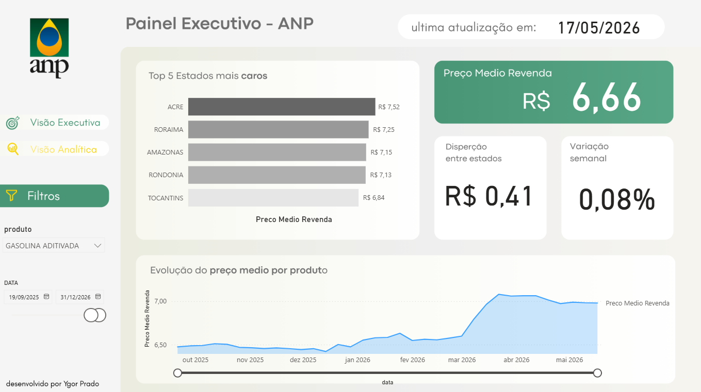
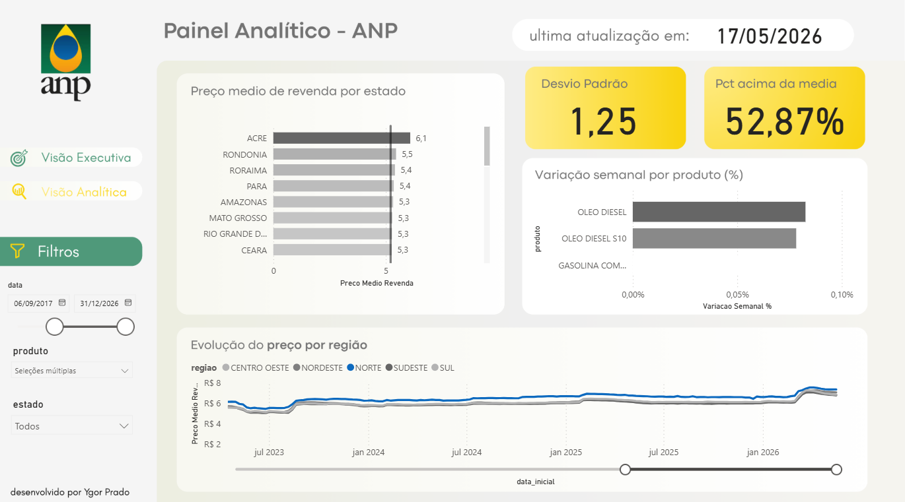
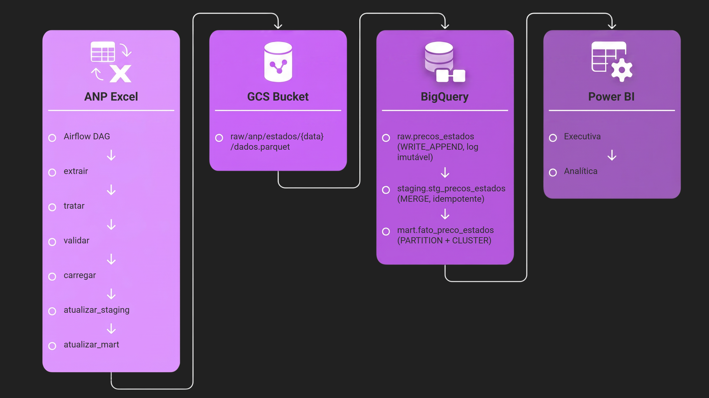

# Radar Combustíveis BR

Pipeline de dados que coleta, processa e analisa os preços de combustíveis em todos os estados brasileiros, do arquivo Excel da ANP até o dashboard no Power BI.

**[Ver dashboard ao vivo](https://app.powerbi.com/view?r=eyJrIjoiNzQxM2Y2MDUtOWIyNC00Y2U3LWIyYWUtMDNkMjM0YzFkOWE5IiwidCI6ImIxNTZhNTQxLWUyMzYtNGVkYi05MWJmLWZjYTI1YzcwMDRmOSJ9)**





## O problema

A ANP publica toda semana os preços médios de combustíveis por estado e produto. O dado chega como uma planilha Excel com 112 mil linhas e histórico desde 2013. Sem nenhuma automação, qualquer análise começa com extração manual, limpeza manual e, geralmente, uma visualização estática que fica desatualizada na semana seguinte.

Esse projeto automatiza o processo do início ao fim.

## Arquitetura



O dado percorre seis etapas orquestradas pelo Airflow:

```
ANP Excel → extrair → tratar → validar → carregar → atualizar_staging → atualizar_mart → Power BI
```

| Etapa                 | O que faz                                                                                       |
| --------------------- | ----------------------------------------------------------------------------------------------- |
| `extrair`           | Lê o Excel, consulta o controle de carga e filtra apenas registros novos                       |
| `tratar`            | Substitui nulos disfarçados por `None`, filtra os 5 produtos vendidos em postos              |
| `validar`           | Schema Pandera valida tipos, estados válidos e unidade de medida antes de qualquer carga       |
| `carregar`          | Salva parquet no GCS e faz `WRITE_APPEND` no BigQuery raw                                     |
| `atualizar_staging` | `MERGE` com `ROW_NUMBER()` para deduplicar e normalizar                                     |
| `atualizar_mart`    | `CREATE OR REPLACE` na tabela fato, particionada por data e clusterizada por estado e produto |

## Stack

- **Orquestração:** Apache Airflow 3.x com TaskFlow API
- **Armazenamento:** Google Cloud Storage (camada raw)
- **Data warehouse:** BigQuery (modelo estrela: raw, staging, mart)
- **Validação:** Pandera com schema explícito como portão do pipeline
- **Visualização:** Power BI Desktop em modo Importar

## Sobre os dados

112.079 linhas, 27 estados, 5 produtos (Gasolina Comum, Gasolina Aditivada, Etanol Hidratado, Oleo Diesel e Oleo Diesel S10), cobertura semanal de 2013 até hoje.

GLP e GNV foram excluídos do escopo: têm unidades incomparáveis com os demais combustíveis (R$/13kg e R$/m³ vs R$/l) e não fazem parte do mix de um posto de abastecimento comum.

## O que os dados mostram

Com Gasolina Comum selecionada e a série histórica completa:

- Acre, Roraima e Rondônia são os estados mais caros de forma consistente. A logística amazônica explica boa parte disso: distância das refinarias, dependência de transporte fluvial.
- O pico de 2022 aparece como uma subida abrupta em todas as regiões. Foi a combinação da crise energética global com o conflito na Ucrânia.
- A queda brusca em meados de 2022 foi a redução do ICMS aprovada pelo governo federal. Dá para ver exatamente no gráfico.
- A diferença entre Norte e Sul do país, que já existia antes, se ampliou após 2022 e não voltou ao patamar anterior.

## Decisões técnicas

Cada decisão de arquitetura tem registro em [docs/decisões.md](docs/decisões.md): por que `MERGE` em vez de truncate+insert, como o `ROW_NUMBER()` resolve duplicatas no BigQuery, por que o controle de carga usa `create_bqstorage_client=False`, e as escolhas de design dos dashboards.

## Como rodar

**Pré-requisitos:** Docker, Python 3.11+, service account GCP com permissões em BigQuery e GCS.

```bash
# Sobe o Airflow
docker compose up -d

# Coloca o xlsx da ANP em scripts/
# Configura a service account em gcp/sa.json

# Acessa localhost:8080 e ativa a DAG pipeline_anp
```

## Estrutura do projeto

```
dags/
  pipeline_anp.py       # DAG (só orquestração, sem lógica de negócio)
scripts/
  config.py             # Constantes centralizadas
  extrair.py
  tratamento.py
  validar.py
  carregar.py
  atualizar_stg.py
  atualizar_mart.py
sql/
  staging/
  marts/
docs/
  decisões.md
  arquitetura.png
powerbi/                # Arquivo .pbix (não versionado)
```
